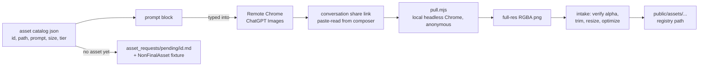

# SoloUnicorn Taste Rework - Plan

**Target repo:** `psyblr-paperclips` (the live SoloUnicorn build). Authority docs are the repo's own `docs/context/` (PRODUCT, VISUAL_BRAND, INTERACTIONS, TASTE_AND_GAME_SENSE, REVIEW_RUBRIC) plus `docs/ASSET_CATALOG.md`; the archived master pack applies only where those cite it. `docs/AGENTS.md` execution rules apply (frozen seams, run-the-app evidence).

---

## Goal Capsule

- **Objective:** The deployed game stops feeling like an operations dashboard: a player experiences real 2.5D contextual assets instead of procedural prisms, a visible company environment that physically evolves garage → ethereal as valuation grows, six desk interactions that are genuinely tactile hypercasual verbs, and MACHINE/SKY visual discipline with earned Y2K-iridescent reward moments — while every existing test and the engine's economics stay intact.
- **Means:** Presentation-layer rework of the existing React/TS app plus a browser-driven image-gen asset pipeline (generate on the connected remote Chrome via ChatGPT Images → conversation share link → local headless-Chrome pull → scripted intake into `public/assets/`), proven end-to-end this session (KTD1, KTD2).
- **Authority hierarchy:** User's brief (this rework's emphasis) > `docs/context/` contracts > `docs/ASSET_CATALOG.md` > existing code as evidence. Engine semantics are frozen seams per `docs/AGENTS.md`: `src/engine/` action names, payload meanings, and state-field meanings do not change; additive presentation state is allowed.
- **Stop conditions:** No deploy. No engine-economics rebalancing. Never ship emoji or the PIL prisms as final language on reworked surfaces — a missing final gets a visibly-non-final fixture plus an `asset_requests/pending/<id>.md` brief. If remote image-gen rate-limits mid-run, continue all code work and leave the un-generated assets in the pending queue; that is a completion-report line, not a blocker.
- **Execution profile:** `npm run check`-equivalent (`npm test` + `npm run typecheck` + `npm run build`) green throughout; visible work verified in the running app per `docs/context/REVIEW_RUBRIC.md`; abandoned experiments removed.

---

## Product Contract

### Summary

Rework SoloUnicorn's presentation and game feel in place. Replace the procedurally drawn icon set with real image-gen 2.5D contextual assets flowing through a scripted pipeline; make the company's evolution tier (already modeled in the engine as `garage | workshop | workstation | growth | ethereal`) a visible, physical environment with an isometric HQ overview and one authored beat per tier-up; upgrade each function room's core interaction to its canonical tactile verb; and re-discipline the visual system into the MACHINE/SKY split with Y2K-iridescent salience reserved for reward moments.

### Problem Frame

The owner is not pleased with the current build's visual aesthetic, progression feel, and game mechanics. Recon confirms why: icons are PIL-drawn gradient prisms (`scripts/generate_assets.py`) rather than the contextual 3D objects `docs/ASSET_CATALOG.md` specifies; the evolution tier exists in engine state but is barely visible as a world; rooms lean on panels and buttons where `docs/context/INTERACTIONS.md` prescribes physical verbs; and the composition drifts toward equal-weight dashboard cards against `docs/context/TASTE_AND_GAME_SENSE.md`.

### Key Decisions

- **Image gen is mandatory and browser-driven** (session decision, user-directed — chosen over Blender-procedural-only: the owner judged that path pointless for this product's icon quality bar). Assets are generated through the connected remote Chrome (ChatGPT Images; Gemini/Nano Banana Pro when available) and transferred via public conversation-share links pulled locally. Governs R1–R3.
- **Rework in place, not greenfield** (session decision, user-directed — chosen over the earlier greenfield rebuild: the product exists and its engine/tests are sound). Frozen seams per `docs/AGENTS.md`. Governs R15, R16.
- **MACHINE/SKY reconciliation of the Y2K brief** (session decision, user-approved via taste docs): graphite MACHINE base with function accents; Y2K iridescence/liquid-metal is reward salience — milestone beats, Ethereal-tier apex, rarity materials — never default chrome on ordinary controls. (origin: docs/context/TASTE_AND_GAME_SENSE.md §2, §4) Governs R8–R10.
- **The evolution fantasy uses the catalog's five material tiers** mapped to the engine's existing `EvolutionTier` values — charcoal garage → gunmetal workshop → gold workstation → liquid-glass growth → Ethereal campus. (origin: docs/ASSET_CATALOG.md §2) Governs R6, R7.
- **Canonical verbs own the room interactions** — Demand resisted swipe/triage, Product semantic assembly, Monetisation price-fit timing, Retention aim/prioritise, Expansion merge/package, Operations scratch/reveal; Finance stays inspect/confirm. (origin: docs/context/INTERACTIONS.md) Governs R11–R14.

### Requirements

**Asset pipeline and real 2.5D assets**

- R1. The repo contains a scripted asset pipeline under `scripts/asset_pipeline/`: a machine-readable asset catalog (id, destination path, semantic object, material tier, accent, prompt block), a share-link puller (headless local Chrome renders a public ChatGPT share page and downloads the full-res PNG), and an intake step (verify alpha + min size, trim margins, resize to catalog spec, optimize, install to `public/assets/...`) — each runnable via npm scripts.
- R2. A seed set of hero assets is generated, pulled, and installed during this run, prioritized: the 7 function nav objects, the founder/agent figure, and per-tier environment key art for the 5 evolution tiers; remaining catalog entries get prompt blocks ready to paste plus `asset_requests/pending/<id>.md` briefs. Rate limits cap the seed set, never the pipeline or the code work.
- R3. Runtime asset resolution prefers an installed generated asset, then any user drop-in by catalog filename, then a visibly-non-final dev fixture (flat wireframe treatment, never emoji, never the old prisms styled as final); `src/engine/assets.ts` paths stay stable so no consumer changes per asset.

**Aesthetic discipline (MACHINE + SKY, Y2K earned)**

- R8. `src/styles/` is reworked to the MACHINE plane: graphite base surfaces from the `docs/context/VISUAL_BRAND.md` palette, center-dominant composition (the work object visually wins over panels), card-usage diet, deliberate type hierarchy with tabular numerals for money, and function accents used locally for meaning — with contrast measured, not assumed.
- R9. SKY treatment (pastel ethereal atmosphere, iridescent salience) appears only at reward moments: tier-up sequence, unicorn victory, relic award, and Ethereal-tier surfaces — one emotional beat each, no replayed cinematics, input never blocked by ornament.
- R10. No emoji anywhere in final reworked surfaces; every semantic icon slot on reworked surfaces shows a generated contextual asset or the visibly-non-final fixture (R3).

**Progression made visible**

- R6. A Company HQ overview (new default view) renders the workspace as a 2.5D isometric scene assembled from generated tier props: six function desks plus a Finance station, the founder at work, and agent presence appearing per function as Automate ranks activate; clicking a desk enters that function's room; desk badges surface queue pressure so switching is informed.
- R7. The environment reflects the engine's current `EvolutionTier` everywhere it is visible (HQ scene, room backdrops, HUD identity): each tier change swaps the material world per the five-tier mapping and plays its single authored tier-up beat (R9); the ThinkPad-in-a-garage start reads unmistakably scrappy, the Ethereal campus unmistakably apex.

**Tactile mechanics per canonical verb**

- R11. Demand and Monetisation interactions are fully tactile: Demand triage is a resisted horizontal swipe with commitment threshold, trajectory feedback, and pre-commit visibility of segment/CAC/expiry; Monetisation is a price-fit timing commit against a visible willingness-to-pay band with decisive contact feedback. Both keep dispatching the existing engine actions unchanged.
- R12. Product's interaction is semantic assembly — components physically fit/snap into requirement slots (pointer-driven, not form selects), with verified state and defect exposure visible before shipping.
- R13. Retention is aim/prioritise (choose the threatened account and intervention against visible deadlines and exposed ARR) and Expansion is merge/package (combine account needs into a package that fits a slot, showing addon ARR and service cost) — both continuing their standby gating when no accounts exist.
- R14. Operations is scratch/reveal diagnosis: physically reveal incident evidence, then commit a repair allocation or an explicit, legible risk bet; consequences route to the existing strain/rot/incident state.
- R15. Every reworked interaction keeps the loop grammar: stake visible before commit, immediate local response within the `docs/context/VISUAL_BRAND.md` motion bands, mechanical result near the action, downstream consequence visible (queue/ledger/HUD), and coalesced feedback on repeats — with synthesized tactile SFX via the existing `soundEngine` and reduced-motion equivalents.

**Integrity**

- R16. All existing tests keep passing unmodified in meaning (test updates only where a reworked surface legitimately changed presentation contracts); `npm test`, `npm run typecheck`, `npm run build` green; engine action semantics untouched.
- R17. A full run loop is exercised in the browser as evidence: new run → triage → assemble → price-lock → (accounts exist) retention/expansion → operations → skill purchase with agents visible in HQ → tier-up beat → quarter review → game over or victory path — desktop, no console errors, reviewed against `docs/context/REVIEW_RUBRIC.md`.

### Success Criteria

- A screenshot of any reworked surface is no longer mistakable for a dashboard: real contextual objects, one dominant work object, graphite calm around it.
- The owner can watch the company physically climb garage → ethereal within a run, with each tier-up landing as one beat.
- Each of the six functions is playable as a distinct physical verb a player could describe without lore, and skill still measurably matters.
- The asset pipeline turns a share link into an installed, correctly-sized game asset with one command.

### Scope Boundaries

- No engine economics changes, rebalancing, or new currencies; frozen seams per `docs/AGENTS.md`.
- No full catalog regeneration this run (120 skill icons + 35 milestones remain PIL until generated via the pipeline; they are pending-queue work, and skill/milestone icon *slots* are restyled to read as non-final rather than regenerated).
- No mobile recomposition pass beyond not breaking the existing mobile views; no PWA/service-worker changes; no deploy; no Blender pipeline (superseded by image gen).
- No copy rewrite pass beyond surfaces the rework touches.

#### Deferred to Follow-Up Work

- Generating the remaining catalog families (skills × tiers, milestones, consumables, threats) through the pipeline once a paid image-gen account is connected (local Chrome extension sign-in, or Gemini/Nano Banana Pro).
- Mobile-first recomposition of the HQ scene; balance validation and human playtest per the archived pack's evidence discipline; Weave/Figma automation of generation.

### Sources

- `docs/context/TASTE_AND_GAME_SENSE.md`, `VISUAL_BRAND.md`, `INTERACTIONS.md`, `PRODUCT.md`, `REVIEW_RUBRIC.md`, `docs/ASSET_CATALOG.md`, `docs/AGENTS.md` — the governing contracts cited throughout.
- Code recon (this session): `src/ui/App.tsx` room routing and tier lookup (`getActiveEvolutionTier`); `src/engine/types.ts` `EvolutionTier` already `garage|workshop|workstation|growth|ethereal`; `src/engine/assets.ts` central asset/path registry; `scripts/generate_assets.py` PIL prism generator (the surface being replaced); 18 engine test files under `src/tests/`.
- Pipeline proof (this session): generated `radar_dish.png` 1254×1254 RGBA-with-alpha via remote Chrome ChatGPT Images → share `https://chatgpt.com/share/6ab86783-0ee0-83e8-91f0-a537774572c4` → local headless pull; scratch script `pull_share.mjs` (becomes `scripts/asset_pipeline/pull.mjs` in U1).

---

## Planning Contract

### Key Technical Decisions

- KTD1. **Asset transfer = public share link + local headless Chrome.** The remote browser generates and shares; `scripts/asset_pipeline/pull.mjs` (Node ≥22, CDP over `--remote-debugging-port`, no npm deps) renders the share page anonymously, finds the full-res `oaiusercontent` image, downloads it. Chosen over extension-side extraction (results truncate/redact) and clipboard reads (permission prompts freeze a remote renderer). The composer paste-and-read trick recovers each share URL.
- KTD2. **Intake normalizes to catalog spec with `sips` + Node** (macOS-native, no ImageMagick dependency): verify alpha and min dimension, trim transparent margins, resize per catalog entry, write to the destination path in `src/engine/assets.ts`'s registry. Deterministic, idempotent, logged.
- KTD3. **The HQ scene is DOM/CSS isometric composition, not canvas:** absolutely-positioned generated sprites on a 2:1 projected grid (a small `iso.ts` helper), CSS transforms for depth and hover, per-tier backdrop art behind it. Cheapest reversible version per taste doc §16; canvas only if perf demands it later.
- KTD4. **Tier theming via CSS custom-property theme layers** keyed off `EvolutionTier` on a root attribute: each tier swaps token values (surfaces, accent temperature, backdrop asset) so every surface inherits the material world without per-component logic.
- KTD5. **Room interaction rework keeps engine actions as the seam:** each room's toy is a presentation-layer pointer-driven component (pointer capture, cancel/resize-safe) that ends by dispatching the same engine actions the current UI dispatches. No reducer semantic changes; additive UI-only state where needed.
- KTD6. **Fixture styling for non-final assets:** one `NonFinalAsset` treatment (dashed outline + label) wrapping any slot whose catalog entry lacks an installed generated asset — honest per ASSET_CATALOG rules, and it makes remaining asset debt visible in-game.

### Assumptions

- The remote browser (connected device "Browser 1") remains reachable for the seed-generation unit; its Free-tier ChatGPT allows at least a handful of generations this run. If it disconnects, U2 degrades to prompt-pack + pending briefs (per R2's cap rule).
- Multi-object sheet generation (2–4 objects per image, sliced at intake) is acceptable for family consistency when limits bite; single-object generations are preferred for hero assets.
- The five-tier material mapping onto the engine's existing tier ids is the owner's intent (catalog §2 names the same journey).
- Desktop-first evidence is sufficient for this run (mobile explicitly deferred).

### High-Level Technical Design

Asset pipeline flow:



Presentation architecture around the frozen engine:

```mermaid
flowchart TB
  subgraph FROZEN["Frozen seams (src/engine, src/store)"]
    RED[reducer + actions]
    TIER[EvolutionTier state]
    REG[assets.ts registry]
  end
  subgraph REWORK["Reworked presentation"]
    HQ[Company HQ iso scene<br/>desks, founder, agents]
    THEME[Tier theme layers<br/>CSS custom properties]
    ROOMS[Six rooms: canonical-verb toys<br/>pointer-driven, engine actions out]
    SKY[SKY beats: tier-up, victory, relic]
    STYLES[MACHINE tokens/base rework]
  end
  TIER --> THEME --> HQ & ROOMS & SKY
  REG --> HQ & ROOMS
  ROOMS -->|same actions as today| RED
  HQ -->|enter room| ROOMS
```



### Output Structure

```text
psyblr-paperclips/
├── scripts/asset_pipeline/
│   ├── catalog.json          # machine-readable asset specs + prompt blocks
│   ├── pull.mjs              # share link → raw png (headless local Chrome)
│   ├── intake.mjs            # verify/trim/resize/install + report
│   └── README.md             # operating the pipeline, incl. remote-browser loop
├── asset_requests/pending/   # briefs for not-yet-generated finals
├── public/assets/            # generated assets land on existing registry paths
└── src/
    ├── styles/               # tokens.css/base.css reworked, tiers.css added
    ├── ui/hq/                # HQScene.tsx, iso.ts, DeskSprite.tsx, AgentSprite.tsx
    ├── ui/juice/             # beats.tsx (SKY sequences), NonFinalAsset.tsx
    └── ui/rooms/*            # per-room toy components upgraded in place
```

---

## Implementation Units

### U1. Asset pipeline tooling

- **Goal:** Share-link → installed game asset with one command; catalog with prompt blocks for every asset family this plan touches.
- **Requirements:** R1, R3.
- **Dependencies:** none.
- **Files:** `scripts/asset_pipeline/catalog.json`, `scripts/asset_pipeline/pull.mjs`, `scripts/asset_pipeline/intake.mjs`, `scripts/asset_pipeline/README.md`, `package.json` (scripts `assets:pull`, `assets:intake`), `src/ui/juice/NonFinalAsset.tsx`.
- **Approach:**
  1. Port the proven scratch `pull_share.mjs` into `pull.mjs` (args: share URL, out path; finds largest `oaiusercontent` img ≥512px, retries, exits nonzero on miss).
  2. `catalog.json` from `docs/ASSET_CATALOG.md` + this plan's new needs (nav objects, tier environments, founder/agent, desk props), each entry: id, destination, size, tier material, accent, full prompt block per the catalog's rendering spec.
  3. `intake.mjs`: `sips`-based verify (alpha required, ≥512px), transparent-margin trim, resize to spec, install to destination; `--report` prints installed vs pending.
  4. `NonFinalAsset` fixture treatment per KTD6.
- **Test scenarios:** Test expectation: none — operational tooling; verified by U2's real usage and the intake `--report` smoke.
- **Verification:** Running pull + intake on the session's existing radar-dish share URL installs a correctly-sized PNG and reports it.

### U2. Seed asset generation and intake

- **Goal:** The hero seed set generated on the remote browser, pulled, installed; everything else queued honestly.
- **Requirements:** R2, R10 (asset side); consumes U1.
- **Dependencies:** U1.
- **Files:** `public/assets/**` (installed seeds), `asset_requests/pending/*.md`, `docs/assets/prompt-pack.md` (regenerated from catalog).
- **Approach:**
  1. Priority order: 7 nav function objects → 5 tier environment key-art backdrops → founder + agent figures → per-tier desk prop set for the HQ scene; sheets (2–4 objects) when limits bite, sliced at intake.
  2. Browser loop per asset: prompt from catalog → generate → share → paste-read link → `assets:pull` → `assets:intake`.
  3. Stop when rate-limited; write pending briefs for every catalog entry not installed; regenerate the prompt pack for the owner.
- **Execution note:** Interactive-tooling unit; evidence is the installed file list + pending report, not unit tests.
- **Test scenarios:** Test expectation: none — content production; gated by intake verification (alpha, size) per file.
- **Verification:** `assets:intake --report` lists installed seed assets; every non-installed catalog id has a pending brief; zero PIL prisms presented as final on surfaces U3–U6 rework.

### U3. MACHINE plane style rework

- **Goal:** The visual base reads calm, graphite, typographically confident; center wins; emoji and prism-styling purged from reworked chrome.
- **Requirements:** R8, R10 (surface side).
- **Dependencies:** U1 (fixture component); U2 assets improve it but do not gate it.
- **Files:** `src/styles/tokens.css`, `src/styles/base.css`, `src/styles/tiers.css` (new), targeted edits in `src/ui/hud/*` and shared chrome.
- **Approach:**
  1. Token pass: palette per VISUAL_BRAND, type scale with tabular numerals, spacing discipline; kill equal-weight card wrappers in HUD chrome.
  2. Tier theme layers per KTD4 (`data-tier` on root; tiers.css swaps custom properties).
  3. Sweep reworked surfaces for emoji → generated asset or `NonFinalAsset`.
- **Test scenarios:**
  - Existing UI-affecting tests still pass after class/markup adjustments (R16).
- **Verification:** Before/after screenshots of HUD + one room show center dominance and calm perimeter; no emoji in reworked chrome; build green.

### U4. Company HQ isometric scene and tier progression

- **Goal:** The progression fantasy on screen: an evolving isometric HQ as default view, desks with queue badges, agents appearing with automation, one authored tier-up beat.
- **Requirements:** R6, R7, R9 (tier-up beat).
- **Dependencies:** U1–U3.
- **Files:** `src/ui/hq/HQScene.tsx`, `src/ui/hq/iso.ts`, `src/ui/hq/DeskSprite.tsx`, `src/ui/hq/AgentSprite.tsx`, `src/ui/juice/beats.tsx`, `src/ui/App.tsx` (route HQ as default view), `src/ui/hq/__tests__/iso.test.ts`.
- **Approach:**
  1. `iso.ts` 2:1 grid→screen projection; HQ composes tier backdrop + desk sprites (per-tier props from catalog) + founder + agent sprites driven by Automate rank state; desk badges read the same queue selectors rooms use (R6).
  2. Tier read from `getActiveEvolutionTier`; theme layer + backdrop swap on change; `beats.tsx` runs the single tier-up sequence (SKY treatment, skippable, input-safe) (R7, R9).
  3. Desk click dispatches the existing set-active-function action and enters the room; HQ reachable via nav.
- **Test scenarios:**
  - `iso.ts` projection round-trips known coordinates.
  - Tier-up beat fires exactly once per tier transition (guard state), not on reload of same tier.
- **Verification:** Dev tier-override walk shows five distinct material worlds; agents appear when an Automate rank activates; tier-up plays once.

### U5. Pipeline-spine toys: Demand swipe, Product assembly, Monetisation price-lock

- **Goal:** The three revenue-pipeline rooms play as their canonical physical verbs.
- **Requirements:** R11, R12, R15.
- **Dependencies:** U3; U4 for HQ entry (not gating).
- **Files:** `src/ui/rooms/demand/*` (swipe card component), `src/ui/rooms/product/*` (assembly board), `src/ui/rooms/monetisation/*` (price band), shared pointer util `src/ui/rooms/shared/pointer.ts`.
- **Approach:**
  1. Demand: pointer-captured resisted swipe with threshold + trajectory; pre-commit shows segment/CAC/expiry (INTERACTIONS contract); dispatches existing triage actions.
  2. Product: components drag-fit/snap into requirement slots; verify state and defect exposure visible pre-ship; same assemble/ship actions.
  3. Monetisation: WTP band with moving fit cursor; press-and-release commit; hit/miss contact feedback; same offer actions.
  4. Motion bands + SFX hooks per R15; `pointercancel`/resize-safe per shared util.
- **Test scenarios:**
  - Pointer commit thresholds: below-threshold release = no dispatch; beyond = exactly one dispatch (per room).
  - Existing room/engine tests (`workstations_and_demand_overhaul`, `minigames_and_hud_fixes`, pipeline tests) pass, updated only where presentation contracts changed (R16).
- **Verification:** Each verb playable start→commit→ledger/queue consequence visible; skill (timing/fit accuracy) changes outcomes as the engine already defines.

### U6. Consequence-loop toys: Retention aim, Expansion merge, Operations scratch

- **Goal:** The remaining three rooms as canonical verbs, standby gating preserved.
- **Requirements:** R13, R14, R15.
- **Dependencies:** U5 (shared pointer util, patterns).
- **Files:** `src/ui/rooms/retention/*`, `src/ui/rooms/expansion/*`, `src/ui/rooms/operations/*`.
- **Approach:**
  1. Retention: threats laid out with deadlines + exposed ARR; aim-and-commit an intervention type; wrong-tool consequences per existing engine rules.
  2. Expansion: merge grid combining account needs into a package shape; fit preview shows addon ARR + service cost pre-commit.
  3. Operations: scratch-reveal mask over incident evidence (pointer-erase), then allocation choice or explicit risk bet with stakes visible pre-commit.
- **Test scenarios:**
  - Standby gating: with zero accounts, Retention/Expansion render standby and dispatch nothing (Zero-Phantom invariant, PRODUCT.md).
  - Scratch reveal completes only past coverage threshold; allocation dispatch matches selection.
  - Existing retention/expansion/operations tests pass (R16).
- **Verification:** Full six-verb quarter playable in browser; consequences land in HUD/ledger.

### U7. Juice, SKY beats, and audio polish

- **Goal:** The feedback layer that makes it satisfying — within taste-doc restraint.
- **Requirements:** R9 (victory/relic beats), R15 (feedback + coalescing + reduced-motion).
- **Dependencies:** U4–U6 hooks.
- **Files:** `src/ui/juice/*` (floaters, particles), `src/audio/soundEngine.ts` (extend synth voices), `src/styles/animations.css`, integration edits.
- **Approach:** Floating deltas near actions; restrained particle salience on qualifying/signing/tier-up; coalesced repeat alerts (sound + visual, ledger preserved); victory and relic beats get their SKY moment; reduced-motion + SFX mute honored everywhere; no input blocking.
- **Test scenarios:** Test expectation: none — presentation; verified by R17 evidence pass (beats once, mute persists, no blocked input).
- **Verification:** Two-minute session demonstrably tactile; repeated churn alerts coalesce.

### U8. Evidence pass and honest completion report

- **Goal:** Prove the rework in the running app and report to the repo's standards.
- **Requirements:** R16, R17.
- **Dependencies:** all prior.
- **Files:** `docs/TASTE_V2_CHANGELOG.md` (append rework entry), completion report (chat/PR body).
- **Approach:** Full-loop browser run per R17 against `docs/context/REVIEW_RUBRIC.md`; capture screenshots per tier and per room; `npm test` + `npm run typecheck` + `npm run build`; report distinguishes implemented/verified vs pending (asset families not yet generated; mobile pass deferred) per `docs/AGENTS.md` completion rules.
- **Test scenarios:** Test expectation: none — evidence unit.
- **Verification:** All gates green; rubric review notes attached; pending queue accurate.

---

## Verification Contract

| Check | Command | Applies to | Gate |
|---|---|---|---|
| Engine + UI tests | `npm test` | U3–U6 | Green; engine semantics untouched |
| Types | `npm run typecheck` | all | Clean |
| Build | `npm run build` | all | No errors |
| Asset intake | `node scripts/asset_pipeline/intake.mjs --report` | U1–U2 | Installed assets pass alpha/size; pending list accurate |
| Full-loop evidence | `npm run dev`, seeded manual run | U8 | R17 journey, desktop, zero console errors |
| Taste review | manual vs `docs/context/REVIEW_RUBRIC.md` | U8 | No taste-killing failure modes from TASTE_AND_GAME_SENSE §15 on reworked surfaces |

## Definition of Done

- R1–R17 satisfied or explicitly listed as deferred; all 8 units complete; all gates green.
- Seed assets installed with alpha at spec; every un-generated catalog id has a pending brief; no emoji or final-styled prisms on reworked surfaces.
- Completion report separates: implemented + verified · asset debt remaining · balance/playtest/mobile explicitly not claimed.
- No dead experiments left in the diff; scratch pipeline files promoted into `scripts/asset_pipeline/`, not duplicated.
